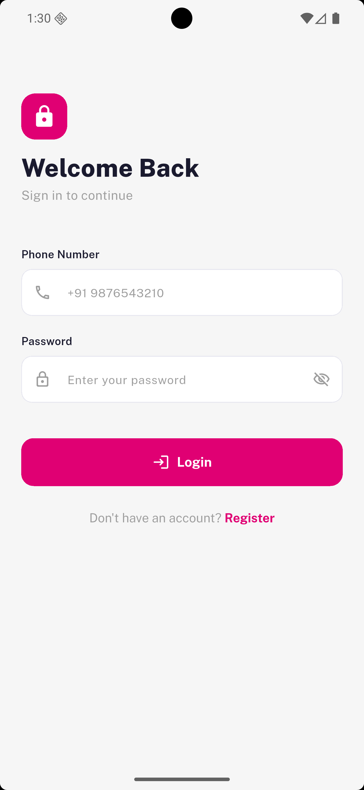
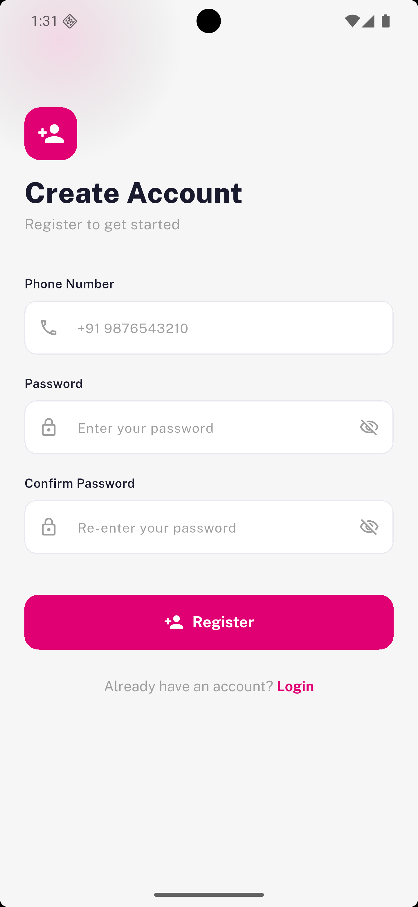
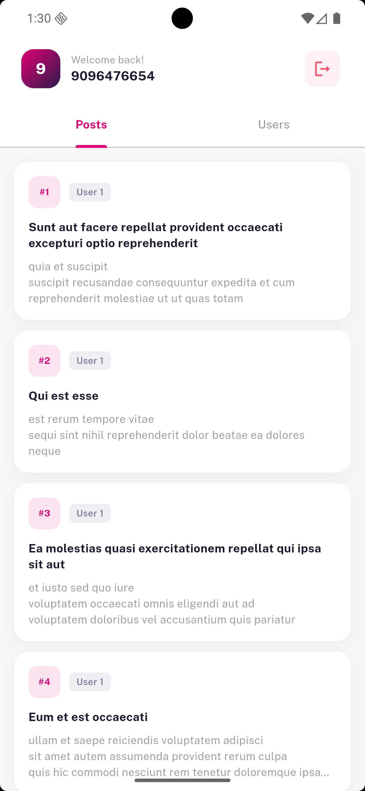
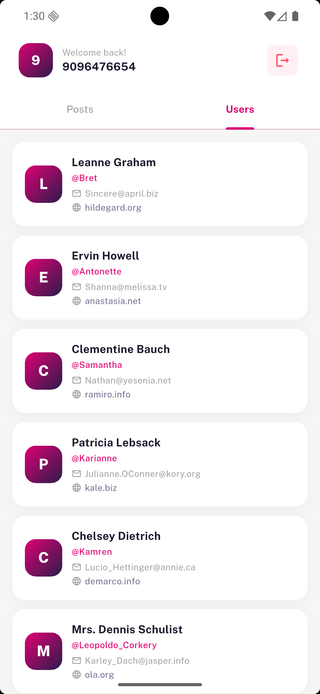

# Kritva Tech Task

A production-grade Flutter application built as part of a practical interview assessment. The app demonstrates a complete authentication flow with form validation, local session management, and a home screen that fetches and displays live data from a REST API — all implemented using the **BLoC** state management pattern and **Clean Architecture** principles, following the Kitty-Chitty folder structure.

---

## Features

### Authentication
- **Login Screen** — Phone number + password login with full validation
- **Register Screen** — New user registration with confirm password check
- **Session Persistence** — Login state saved via `SharedPreferences`; user stays logged in across app restarts
- **Logout** — Clears session and redirects to login

### Validation
| Field | Rule |
|---|---|
| Phone | Required · 10 digits · Must start with 6–9 (Indian format) |
| Password | Required · Minimum 6 characters |
| Confirm Password | Must match the password field |
| Duplicate Phone | Blocked at registration with a clear error message |

### Home Screen
- **Posts Tab** — Fetches 100 posts from `jsonplaceholder.typicode.com/posts`
- **Users Tab** — Fetches 10 users from `jsonplaceholder.typicode.com/users`
- **Lazy Loading** — Each tab fetches data only when first opened
- **Pull to Refresh** — Swipe down to re-fetch data on any tab
- **Shimmer Skeleton** — Animated loading placeholders while data is being fetched
- **Error State** — Friendly error UI with a retry button on network failure

### UX Details
- Staggered slide + fade entrance animations on auth screens
- Password visibility toggle on all password fields
- Keyboard dismiss on tap outside
- SnackBar feedback for success and error states
- Responsive layout using `flutter_screenutil`

---

## Tech Stack

| Layer | Technology |
|---|---|
| Language | Dart 3.x |
| Framework | Flutter |
| State Management | flutter_bloc (BLoC pattern) |
| Navigation | go_router |
| HTTP Client | Dio |
| Dependency Injection | get_it |
| Local Storage | shared_preferences |
| Responsive UI | flutter_screenutil |
| Font | Public Sans |

---

## Project Structure

```
lib/
├── main.dart                          # Entry point, MultiBlocProvider setup
├── init_dependencies.dart             # GetIt service locator registration
│
├── core/
│   ├── config/
│   │   ├── app_bloc_observer.dart     # Global BLoC logging observer
│   │   └── app_config.dart            # Base URL and endpoint constants
│   │
│   ├── constants/
│   │   └── app_strings.dart           # All UI strings in one place
│   │
│   ├── exceptions/
│   │   └── server_exception.dart      # Typed API exception
│   │
│   ├── routes/
│   │   └── app_router.dart            # GoRouter config + route constants
│   │
│   ├── services/
│   │   ├── api_client/
│   │   │   ├── model/api_response_model.dart
│   │   │   └── service/base_service.dart   # Dio setup + safeRequest wrapper
│   │   └── shared_preferences/
│   │       └── shared_preferences_service.dart
│   │
│   ├── theme/
│   │   ├── colors.dart
│   │   ├── text_styles.dart
│   │   ├── app_theme.dart
│   │   └── app_dimens.dart
│   │
│   └── utils/widgets/
│       ├── app_text_field.dart        # Reusable labelled text input
│       └── primary_button.dart        # Branded button with loading state
│
└── features/
    │
    ├── auth/
    │   ├── data/
    │   │   ├── models/user_model.dart
    │   │   └── repositories/auth_repository_impl.dart
    │   │
    │   ├── domain/
    │   │   └── repositories/auth_repository.dart   # Abstract contract
    │   │
    │   └── presentation/
    │       ├── bloc/
    │       │   ├── auth_bloc.dart
    │       │   ├── auth_event.dart
    │       │   └── auth_state.dart
    │       └── pages/
    │           ├── login_page.dart
    │           └── register_page.dart
    │
    └── home/
        ├── data/
        │   ├── models/
        │   │   ├── post_model.dart
        │   │   └── user_data_model.dart
        │   ├── datasources/home_remote_datasource.dart
        │   └── repositories/home_repository_impl.dart
        │
        ├── domain/
        │   └── repositories/home_repository.dart    # Abstract contract
        │
        └── presentation/
            ├── bloc/
            │   ├── home_bloc.dart
            │   ├── home_event.dart
            │   └── home_state.dart
            ├── pages/home_page.dart
            └── widgets/
                ├── post_card.dart
                ├── user_card.dart
                ├── shimmer_loader.dart
                └── error_view.dart
```

---

## Architecture

The project follows **Clean Architecture** with a strict separation between layers:

```
Presentation (BLoC / Pages / Widgets)
        ↓
   Domain (Repository Interfaces)
        ↓
    Data (Models / Implementations / DataSources)
```

- **Presentation** — BLoC handles all state. Pages and widgets only emit events and react to states. Zero business logic in the UI.
- **Domain** — Abstract repository contracts that the presentation layer depends on. Completely framework-independent.
- **Data** — Concrete implementations of domain repositories. Talks to `SharedPreferences` (auth) and Dio/REST API (home).

Dependency injection is handled by `get_it` registered in `init_dependencies.dart`. BLoCs are provided globally via `MultiBlocProvider` in `main.dart`.

---

## API

This project uses [JSONPlaceholder](https://jsonplaceholder.typicode.com/) — a free, public REST API for testing.

| Endpoint | Description |
|---|---|
| `GET /posts` | Returns 100 dummy posts |
| `GET /users` | Returns 10 dummy users |

No API key required. Data is read-only.

---

## Getting Started

### Prerequisites
- Flutter SDK `^3.5.0`
- Dart SDK `^3.5.0`
- Android Studio / VS Code with Flutter plugin

### Setup

```bash
# 1. Clone or extract the project
cd kitty_chitty

# 2. Install dependencies
flutter pub get

# 3. Copy font files from the original Kitty-Chitty project
# Place PublicSans .ttf files at:
# assets/fonts/PublicSans/

# 4. Run the app
flutter run
```

### Android Permission
The following permission is already added in `android/app/src/main/AndroidManifest.xml`:

```xml
<uses-permission android:name="android.permission.INTERNET" />
<uses-permission android:name="android.permission.ACCESS_NETWORK_STATE" />
```

No additional setup needed for Android.

---

## BLoC Events & States

### AuthBloc

| Event | Description |
|---|---|
| `AuthLoginRequested` | Validates credentials against local storage |
| `AuthRegisterRequested` | Creates a new user in local storage |
| `AuthLogoutRequested` | Clears session and navigates to login |

| State | Description |
|---|---|
| `AuthInitial` | Default state |
| `AuthLoading` | Button shows spinner |
| `AuthLoginSuccess` | Navigates to home |
| `AuthRegisterSuccess` | Navigates to login with success message |
| `AuthLogoutSuccess` | Navigates back to login |
| `AuthFailure` | Shows error SnackBar with message |

### HomeBloc

| Event | Description |
|---|---|
| `HomeFetchPostsRequested` | Fetches posts from API |
| `HomeFetchUsersRequested` | Fetches users from API |
| `HomeTabChanged` | Switches tab; triggers lazy data fetch |

| State field | Description |
|---|---|
| `isLoadingPosts / isLoadingUsers` | Controls shimmer skeleton |
| `posts / users` | Populated list after successful fetch |
| `postsError / usersError` | Non-null when fetch fails; shows ErrorView |
| `currentTabIndex` | Active tab index |

---

## Navigation Flow

```
App Start
    │
    ├── isLoggedIn == true  ──→  /home
    │
    └── isLoggedIn == false ──→  /login
                                    │
                          ┌─────────┴──────────┐
                          │                    │
                        Login              Register
                          │                    │
                    AuthLoginSuccess    AuthRegisterSuccess
                          │                    │
                        /home              /login
                          │
                       Logout
                          │
                        /login
```

---

## Screens Overview

| Screen | Route | Description |
|---|---|---|
| Login | `/login` | Phone + password form. Navigates to home on success. |
| Register | `/register` | Phone + password + confirm. Navigates to login on success. |
| Home | `/home` | Tabbed screen. Posts tab loads by default. Users tab loads on first tap. |

### App Screenshots
<p align="center">
  
  
  
  
</p>
---

## Author

Built as an interview practical task demonstrating:
- Flutter BLoC state management
- Clean Architecture folder structure
- REST API integration with Dio
- Form validation best practices
- GoRouter navigation with auth guards
- Reusable widget design